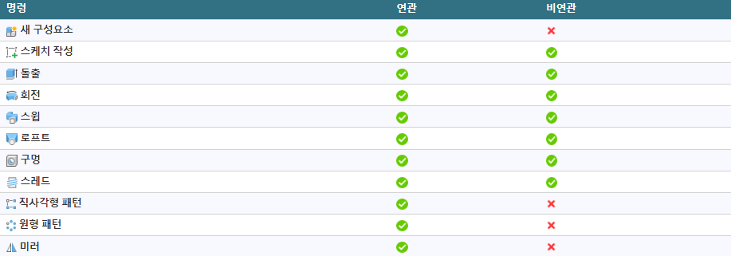

내부 편집
=====

Fusion 360의 **내부 편집**을 사용하면 상위 디자인을 종료하지 않고 조립품 환경에서 외부 구성요소를 활성화하고 편집할 수 있습니다.

**내부 편집**을 활성화하면 구성요소를 편집할 때 조립품 내의 실제 위치에서 구성요소를 볼 수 있습니다.

**내부 편집**을 사용하면 상위 디자인의 컨텍스트 내에서 외부 구성요소를 편집할 수 있으므로 하향식 디자인 접근 방식을 보다 쉽게 사용할 수 있습니다.

외부 구성요소에 대해 **내부 편집**을 활성화하는 경우:

*   외부 구성요소가 캔버스에 표시됩니다.
*   상위 디자인의 다른 구성요소가 비활성화됩니다. 이러한 객체는 편집할 수 없지만 캔버스에 계속 표시되어 디자인의 전체 컨텍스트를 제공합니다.
*   외부 구성요소와 비활성 구성요소의 형상 간에 연관 관계를 작성하거나 상대 거리를 측정할 수 있습니다.

**내부 편집 종료** 를 클릭한 후 참조된 구성요소의 크기나 위치를 변경하면 방금 편집한 구성요소도 업데이트됩니다.

주: 구성요소는 상위 디자인의 컨텍스트 내에서만 업데이트됩니다.

환경 개요
-----

1.  **내부 편집 메뉴 및 경계**:
    *   메뉴가 캔버스 상단에 표시됩니다.
        *   **비연관** : 로컬 편집만 허용합니다. 조립품의 다른 구성요소와 이 외부 구성요소 간에 연관 참조를 작성하지 않습니다.
        *   **연관** : 조립품의 다른 구성요소와 이 외부 구성요소 간에 연관 참조를 작성합니다.
        *   **참조 객체** : 현재 디자인과 다른 구성요소, 바디, 스케치 및 구성 형상 간의 연관 참조를 작성합니다.
    *   아이콘은 활성 조립품 컨텍스트의 연관성을 나타냅니다.
    *   편집 중인 외부 구성요소의 이름이 표시됩니다.
    *   활성 조립품 컨텍스트의 이름이 괄호 안에 표시됩니다.
    *   캔버스 주위에 파란색 프레임이 나타납니다.
2.  **브라우저 및 캔버스의 활성 외부 구성요소**:
    *   편집 중인 외부 구성요소가 브라우저에서 파란색으로 강조 표시되고 캔버스에 완전히 불투명으로 표시됩니다.
    *   **조립품 컨텍스트** 폴더에는 작성하는 조립품 컨텍스트가 포함되어 있습니다.
    *   활성 조립품 컨텍스트가 파란색으로 강조 표시됩니다.
3.  **외부 구성요소의 타임라인이 표시됩니다.**
4.  **기타 구성요소**:
    *   디자인의 다른 구성요소는 비활성화되어 있습니다.
    *   비활성 구성요소는 낮은 불투명도로 표시되지만 여전히 선택할 수 있습니다.

조립품 컨텍스트
--------

상위 및 같은 계열 구성요소의 형상을 참조하여 편집 중인 구성요소의 크기나 쉐이프를 정의하는 경우 상위 디자인에 **조립품 컨텍스트**가 작성됩니다.

**조립품 컨텍스트**는 특정 시점의 상위 디자인과 외부 구성요소 간의 연결입니다. 조립품과 관련된 위치 정보가 들어 있습니다. 이 대화상자에서는 상위 디자인에 대한 연관을 유지하기 위해 형상이 파생됩니다.

전체 **조립품 컨텍스트**에는 다음이 포함됩니다.

*   브라우저에서 하위 외부 구성요소 아래에 내포된 **조립품 컨텍스트** 폴더의 **조립품 컨텍스트**.
    
    
    
*   상위 디자인의 **타임라인**에 표시되는 표식기.
    
    
    

주: **조립품 컨텍스트** 폴더에는 각 **조립품 컨텍스트**가 별도로 보관됩니다.

다음을 수행하는 경우 **내부 편집** 중에 **조립품 컨텍스트**가 작성됩니다.

*   치수를 다른 구성요소와 연관
*   구속조건을 다른 구성요소와 연관
*   스케치 투영을 다른 구성요소와 연관
*   구성요소를 제 위치로 이동하고 현재 위치 캡처

**조립품 컨텍스트**가 활성 상태일 때 작성한 피쳐는 해당 피쳐에 링크됩니다. **조립품 컨텍스트** 피쳐가 상위 디자인의 **타임라인**에 추가됩니다.

형상을 참조하면 외부 구성요소에 **조립품 컨텍스트**로 파생됩니다. 이렇게 하면 형상을 조립품 외부에서 열 때 외부 구성요소에 사용할 수 있습니다. 다음과 같은 경우 외부 구성요소를 자체 탭에서 열고 **조립품 컨텍스트**를 활성화할 수 있습니다.

*   조립품 컨텍스트 외부에서 작업하기 위해 참조해야 하는 모든 객체를 참조했습니다.
*   **내부 편집** 내에서 사용할 수 있는 것 이상의 확장된 모델링 도구 세트에 액세스해야 합니다.

#### 로컬 컨텍스트

각 **조립품 컨텍스트** 폴더에는 **로컬 컨텍스트**가 포함되어 있습니다.

**로컬 컨텍스트**는 외부 구성요소를 디자인을 해당 문서 탭에서 열 때 디자인이 표시되는 것으로 나타냅니다. 하위 구성요소에 대한 고유한 위치 세트를 유지합니다.

**로컬 컨텍스트**를 활성화하는 경우:

*   상위 디자인의 형상이 숨겨져 있어 선택할 수 없습니다.
*   상위 디자인의 형상에는 연관을 지정할 수 없습니다.
*   외부 구성요소의 하위 구성요소는 외부 구성요소에서의 위치에 따라 배치됩니다.
*   조립품 컨텍스트에서 사용할 수 없는 위치, 접합 및 동작과 관련된 일부 명령을 사용할 수 있습니다.

주: 조립품 환경에서 로컬만 명령을 활성화하면 **로컬 컨텍스트**로 자동 전환됩니다. 명령이 종료되면 **로컬 컨텍스트**에 남아 있게 됩니다.

#### 자동 활성화

**조립품 컨텍스트**에서 형상에 종속된 피쳐를 편집하면 **조립품 컨텍스트**가 자동으로 활성화됩니다.

참조 객체
-----

**참조 객체** 명령은 조립품의 외부 구성요소와 다른 디자인 피쳐 간에 명시적으로 연관 참조를 작성합니다.

연관 **내부 편집** 중에 **참조 객체** 명령은 캔버스 상단의 **내부 편집** 메뉴에서 사용할 수 있습니다.

**브라우저** 또는 캔버스에서 디자인 피쳐를 선택합니다. 참조된 디자인 피쳐는 **조립품 컨텍스트**로 파생됩니다.

상세 디자인 작업을 시작하기 전에 **참조 객체** 명령을 사용하여 조립품의 객체를 명시적으로 참조할 수 있습니다. 상세 디자인 작업을 보다 명확하고 쉽게 수행하려면 컨텍스트에 따라 구성요소에 중요한, 조립품 내 객체만 참조해야 합니다.

  
조립품 뷰

  

참조 객체가 있는 활성화된 조립품 컨텍스트

note: **참조 객체** 명령은 비연관 **내부 편집** 중에는 사용할 수 없습니다.

컨텍스트에서 외부 구성요소 편집

       

컨텍스트에서 외부 구성요소 편집
=================

Fusion 360의 상위 디자인 컨텍스트에서 외부 구성요소를 편집하는 방법을 알아봅니다.

1.  외부 구성요소를 디자인에 삽입하려면 **데이터 패널**에서 구성요소를 탐색하고 마우스 오른쪽 버튼을 클릭한 다음 **현재 디자인에 삽입**을 클릭합니다.
    
2.  **브라우저**에서 편집하려는 외부 구성요소 위에 마우스를 놓은 다음 **내부 편집** 을 클릭합니다.
    
    
    
3.  선택 사항: **내부 편집** 메뉴에서 연관성을 조정합니다.
    
    *   **연관**
        
    *   **비연관**
        
        
        
4.  구성요소를 비연관 변경으로 변경합니다.
    
    *   스케치 및 기타 피쳐를 직접 편집할 수 있습니다.
    *   비활성 구성요소를 기준으로 거리를 측정합니다.
5.  **조립품 컨텍스트**를 작성하려면 상위 디자인의 비활성 구성요소에서 형상을 참조합니다.
    
    *   모서리, 면 및 점
        
    *   치수 및 구속조건
        
    *   위치
        
    *   투영법
        
    *   종료
        
        주: 비활성 구성요소의 형상을 참조하는 경우 **조립품 컨텍스트** 폴더가 외부 구성요소 노드 아래의 **브라우저**에 작성됩니다. 이 폴더에 **컨텍스트**가 작성되며, 나중에 돌아가서 편집할 수 있습니다.
        
        
        
6.  **내부 편집** 메뉴에서 **내부 편집 종료** 를 클릭하여 상위 디자인으로 돌아갑니다.
    
    
    
7.  변경 사항을 저장합니다.
    

팁: **조립품 컨텍스트**를 작성하여 체계적으로 관리할 수 있도록 명명합니다.

상위 디자인의 **타임라인** 내에 **조립품 컨텍스트**가 작성됩니다.

조립품에서 연관 참조 작성

       

조립품에서 연관 참조 작성
==============

**참조 객체** 명령을 사용하여 Fusion 360의 조립품에 있는 외부 구성요소와 다른 디자인 피쳐 간의 명시적 연관 참조를 작성하는 방법에 대해 알아봅니다.

연관 참조 작성
--------

1.  외부 구성요소가 포함된 조립품을 엽니다.
    
2.  **브라우저**에서 외부 구성요소 옆에 있는 **내부 편집** 을 클릭합니다.
    
    
    
3.  캔버스 상단에서 **내부 편집** 메뉴를 확장합니다.
    
4.  **참조 객체**를 선택합니다.
    
    **참조 객체** 대화상자가 표시됩니다.
    
5.  **브라우저** 또는 캔버스에서 조립품에 참조할 디자인 피쳐를 선택합니다.
    
    *   구성요소
        
    *   바디
        
    *   스케치
        
    *   구성 형상
        
        
        
6.  선택 사항: 대화상자에서 객체, 폴더 또는 구성요소를 선택한 다음 `X` 버튼을 클릭하여 제외합니다.
    
7.  **확인**을 클릭합니다.
    
    **브라우저**에서 선택한 디자인 피쳐는 **조립품 컨텍스트**로 파생됩니다.
    
    
    
8.  **내부 편집** 메뉴에서 **내부 편집 종료** 를 클릭하여 상위 디자인으로 돌아갑니다.
    
9.  조립품을 저장합니다.
    
10.  외부 구성요소를 마우스 오른쪽 버튼으로 클릭합니다.
    
11.  **열기**를 선택하여 해당 문서 탭에서 디자인을 엽니다.
    
12.  **브라우저**에서 **조립품 컨텍스트** 폴더를 확장합니다.
    
13.  **조립품 컨텍스트** 옆에 있는 **컨텍스트 활성화** 라디오 버튼을 클릭하여 활성화합니다.
    
    
    

**참조 객체** 명령을 사용하여 참조한 디자인 피쳐는 상황에 따라 표시됩니다. 불투명도가 감소됩니다. 외부 구성요소에서 작업할 때 디자인 피쳐를 참조할 수 있습니다.

외부 구성요소의 형상과 참조된 디자인 피쳐 간에 연관 관계를 작성하면 **참조 객체** 대화상자에서 객체에 굵은 밑줄과 밑줄이 표시됩니다. 디자인 피쳐를 제외하면 객체가 회색 취소선으로 표시됩니다.

> note: 참조된 디자인 피쳐가 조립품에서 변경되면 조립품을 업데이트하고 오래된 조립품 컨텍스트를 동기화할 때 변경 사항이 외부 구성요소에 반영됩니다. 외부 구성요소의 형상과 조립품의 참조된 디자인 피쳐 사이에 작성한 연관 관계는 변경 사항을 반영하도록 업데이트됩니다.

비디오
---

기존 조립품 컨텍스트 편집

       

기존 조립품 컨텍스트 편집
==============

Fusion 360에서 기존 조립품 컨텍스트를 활성화하고 편집하는 방법에 대해 알아봅니다.

조립품 환경이나 자체 탭의 **브라우저** 또는 **타임라인**에서 기존 **조립품 컨텍스트**를 활성화하고 편집할 수 있습니다.

브라우저에서 조립품 컨텍스트 활성화
-------------------

1.  **브라우저**에서 외부 구성요소의 노드를 확장합니다.
    
2.  **조립품 컨텍스트** 폴더를 확장합니다.
    
3.  **조립품 컨텍스트** 위에 마우스를 놓은 다음 **컨텍스트 활성화** 라디오 버튼을 클릭합니다.
    
    주: **조립품 컨텍스트**를 마우스 오른쪽 버튼으로 클릭하고 **컨텍스트 활성화**를 선택할 수도 있습니다.
    
4.  필요에 따라 변경합니다.
    
5.  **내부 편집 종료** 를 클릭하여 상위 디자인으로 돌아갑니다.
    

주: 조립품 내에서만 **조립품 컨텍스트**를 편집할 수 있습니다.

**조립품 컨텍스트**를 편집할 때 외부 구성요소에서 직접 작업할 때 다운스트림용으로 사용할 수 있도록 추가 형상을 **조립품 컨텍스트**에 참조할 수 있습니다.

타임라인에서 조립품 컨텍스트 편집
------------------

1.  **타임라인**에서 **조립품 컨텍스트** 피쳐를 찾습니다.
2.  **조립품 컨텍스트**를 마우스 오른쪽 버튼으로 클릭한 다음 **컨텍스트 편집**을 선택합니다.
3.  필요에 따라 변경합니다.
4.  **내부 편집 종료** 을 클릭하여 상위 디자인으로 돌아갑니다.

조립품 컨텍스트 외부에서 조립품 컨텍스트 편집
-------------------------

다음과 같은 경우 자체 탭에서 외부 구성요소를 열고 **조립품 컨텍스트**를 활성화합니다.

*   조립품 컨텍스트 외부에서 작업하기 위해 참조해야 하는 모든 객체를 참조했습니다.
*   **내부 편집** 내에서 사용할 수 있는 것 이상의 확장된 모델링 도구 세트에 액세스해야 합니다.

다음을 수행하기 전에 다음을 수행합니다.

*   **내부 편집**을 사용하여 자체 탭에서 외부 구성요소를 열고 **조립품 컨텍스트**를 활성화할 때 표시하려는 모든 객체를 연관적으로 참조했는지 확인합니다.
*   **참조 객체**를 사용하여 아직 연관적으로 참조하지 않은 객체를 보려면 선택합니다.

1.  외부 구성요소를 자체 탭에서 엽니다.
    
    *   **브라우저**에서 외부 구성요소를 마우스 오른쪽 버튼으로 클릭한 다음 **열기**를 선택합니다.
    *   **데이터 패널**에서 디자인으로 직접 이동한 다음 두 번 클릭하여 엽니다.
2.  **브라우저**에서 **조립품 컨텍스트** 폴더를 확장합니다.
    
3.  **조립품 컨텍스트** 위에 마우스를 놓은 다음 **컨텍스트 활성화** 라디오 버튼을 클릭합니다.
    
    조립품에서 연관적으로 참조하거나 **참조 객체** 명령에서 명시적으로 추가한 모든 객체는 **조립품 컨텍스트**에서 작업하는 동안 불투명도가 낮아져 캔버스에 표시됩니다.
    
4.  확장된 모델링 도구 세트를 사용하여 디자인을 편집할 수 있습니다.
    
5.  **조립품 컨텍스트** 편집을 완료한 후에는 다음을 수행합니다.
    
    *   **로컬 컨텍스트**로 다시 전환하여 계속 작업합니다.
    *   디자인을 저장합니다.

주: 위치, 접합 또는 동작과 관련된 명령을 사용하는 경우 Fusion 360에서 자동으로 **로컬 컨텍스트**로 전환됩니다.

조립품 컨텍스트 동기화

       

조립품 컨텍스트 동기화
============

사용자 또는 프로젝트 멤버가 **조립품 컨텍스트**에서 참조하는 **타임라인**의 피쳐 업스트림을 변경하면 Fusion 360의 조립품과 동기화되지 않습니다.

**동기화되지 않음** 이 표시됩니다.

*   **타임라인**에서 동기화되지 않은 각 **조립품 컨텍스트** 피쳐에 있습니다.
    
*   **브라우저**에서 **조립품 컨텍스트** 폴더 및 동기화되지 않은 각 **조립품 컨텍스트** 옆에 있습니다.
    
    
    

각 **조립품 컨텍스트**를 개별적으로 동기화하거나 모든 **조립품 컨텍스트**를 한 번에 동기화할 수 있습니다.

단일 조립품 컨텍스트 동기화
---------------

1.  **타임라인**에서 동기화되지 않은 **조립품 컨텍스트** 를 찾습니다.
2.  **조립품 컨텍스트** 피쳐를 마우스 오른쪽 버튼으로 클릭합니다.
3.  **조립품 컨텍스트 동기화**를 클릭합니다.

**조립품 컨텍스트**가 업데이트되어 참조된 객체의 변경 사항을 반영합니다.

모든 조립품 컨텍스트 동기화
---------------

1.  **타임라인**에서 동기화되지 않은 **조립품 컨텍스트**  중 하나를 찾습니다.
    
2.  **조립품 컨텍스트** 피쳐를 마우스 오른쪽 버튼으로 클릭합니다.
    
3.  **모든 조립품 컨텍스트 동기화**를 클릭합니다.
    
    
    

**조립품 컨텍스트**가 업데이트되어 참조된 객체의 변경 사항을 반영합니다.

팁
-

*   복잡한 조립품에서는 모든 변경 사항이 완전히 동기화되려면 **모든 조립품 컨텍스트 동기화** 명령을 여러 번 사용해야 할 수 있습니다.
*   **모든 조립품 컨텍스트 동기화** 명령은 둘 이상의 조립품 컨텍스트가 동기화되지 않은 경우에만 사용할 수 있습니다.
*   또한 **브라우저**에서 비동기화 조립품 컨텍스트 하나를 마우스 오른쪽 버튼으로 클릭하여 동기화할 수 있습니다.

연관성

       

내부 편집 연관성
=========

Fusion 360의 **내부 편집** 세션에 대한 연관성을 제어할 수 있습니다.

다음과 같은 두 가지 연관성 옵션이 있습니다.

*   **연관**
*   **비연관**

연관(기본값)
-------

연관성이 **연관**으로 설정된 경우 다음을 수행할 수 있습니다.

*   별도의 탭에서 피쳐를 편집하는 것처럼 구성요소에 피쳐를 추가하거나 기존 피쳐를 편집합니다.
*   디자인 내의 컨텍스트에서 다른 구성요소를 볼 수 있습니다.
*   디자인의 다른 구성요소까지 측정합니다.
*   디자인에 있는 다른 구성요소의 형상을 참조합니다.
*   디자인에서 **조립품 컨텍스트**를 작성합니다.

비연관
---

연관성이 **비연관**으로 설정된 경우 다음을 수행할 수 있습니다.

*   별도의 탭에서 피쳐를 편집하는 것처럼 구성요소에 피쳐를 추가하거나 기존 피쳐를 편집합니다.
*   디자인 내의 컨텍스트에서 다른 구성요소를 볼 수 있습니다.
*   디자인의 다른 구성요소까지 측정합니다.

다음과 같은 작업을 수행할 수 없습니다.

*   디자인에 있는 다른 구성요소의 형상을 참조합니다.
*   디자인에서 **조립품 컨텍스트**를 작성합니다.

연관성 조정

       

연관성 조정
======

Fusion 360의 **내부 편집** 세션에 대한 연관성을 조정하는 방법을 알아봅니다.

활성 내부 편집 세션에서 연관성 조정
--------------------

**내부 편집**을 활성화하면 연관 참조를 작성하기 전에 **연관**과 **비연관** 간에 전환할 수 있습니다.

1.  브라우저에서 편집하려는 외부 구성요소 옆에 있는 **내부 편집** 을 클릭하거나 **조립품 컨텍스트** 폴더에서 기존 컨텍스트를 마우스 오른쪽 버튼으로 클릭하고 **컨텍스트 활성화**를 클릭합니다.
    
2.  캔버스 상단의 **내부 편집** 메뉴에서 연관성 드롭다운 메뉴를 클릭한 다음 옵션 중 하나를 클릭합니다.
    
    *   **연관**
        
    *   **비연관**
        
        
        

주: 활성 컨텍스트 내에서 연관 참조를 이미 작성한 경우 연관성을 **비연관**으로 전환할 수 없습니다.

기본 설정
-----

새 **내부 편집** 세션에서 연관성에 대한 기본 설정을 지정할 수 있습니다.

1.  오른쪽 상단 구석의 응용프로그램 막대에서 내 프로파일을 클릭합니다.
2.  **기본 설정**을 선택합니다.
3.  **일반 > 디자인** 섹션에서 **내부 편집 세션 동안 조립품 컨텍스트 작성 허용** 옆의 확인란을 선택하거나 선택취소합니다.
4.  **확인**을 클릭합니다.

이 설정을 사용하면 새 **내부 편집** 세션이 기본적으로 **연관**으로 지정됩니다.

이 설정을 비활성화하면 새 **내부 편집** 세션이 기본적으로 **비연관**으로 설정됩니다.

내부 편집 참조

       

내부 편집 참조
========

다음 명령은 **내부 편집**을 통해 Fusion 360에서 사용할 수 있습니다.

디자인 > 스케치 > 작성
--------------

스케치에 대한 모든 **작성** 명령은 다음을 제외한 모든 연관 및 비연관 **내부 편집**에서 사용할 수 있습니다.

*    **3D 형상 포함**
*    **곡면에 투영**
*    **교차 곡선**

디자인 > 스케치 > 수정
--------------

스케치에 대한 모든 **수정** 명령은 연관 및 비연관 **내부 편집**에서 모두 사용할 수 있습니다.

디자인 > 스케치 > 구속조건
----------------

스케치에 대한 모든 **구속조건** 명령은 연관 및 비연관 **내부 편집**에서 모두 사용할 수 있습니다.

디자인 > 솔리드 > 작성
--------------

솔리드 바디에 대해 다음 **작성** 명령은 **내부 편집**에서 사용할 수 있습니다.

디자인 > 솔리드 > 수정
--------------

솔리드 바디에 대해 다음 **수정** 명령은 연관 및 비연관 **내부 편집**에서 모두 사용할 수 있습니다.

*    **밀고 당기기**
*    **모깎기**
*    **모따기**
*    **쉘**
*    **기울기**
*    **축척**
*    **결합**
*    **간격띄우기 면**
*    **면 분할**
*    **바디 분할**
*    **이동/복사**
*    **삭제**
*    **모양**
*    **물리적 재질**
*    **재질 관리**
*    **매개변수 관리**
*    **모두 계산**

디자인 > 곡면 > 작성
-------------

곡면 바디에 대한 다음 **작성** 명령은 연관 및 비연관 **내부 편집**에서 모두 사용할 수 있습니다.

*    **돌출**
*    **회전**
*    **스윕**

디자인 > 판금 > 작성
-------------

판금 구성요소에 대한 다음 **작성** 명령은 연관 및 비연관 **내부 편집**에서 모두 사용할 수 있습니다.

*    **플랜지**
*    **절곡부**
*    **판금으로 변환**

디자인 > 판금 > 수정
-------------

판금 구성요소에 대한 다음 **수정** 명령은 연관 및 비연관 **내부 편집**에서 모두 사용할 수 있습니다.

*    **전개**
*    \*_재접힘 \*_
*    **판금 규칙**

디자인 > 조립
--------

다음 **조립** 명령은 연관 및 비연관 **내부 편집**에서 모두 사용할 수 있습니다.

*    **접합**
*    **현재 위치에서 접합**
*    **강체 그룹**
*    **접합 구동**

note: 접합과 관련된 모든 명령은 **로컬 컨텍스트**에서만 사용할 수 있습니다. **내부 편집** 중에 이러한 명령을 활성화하면 Fusion 360에서 자동으로 **로컬 컨텍스트**를 활성화합니다.

디자인 > 구성
--------

평면, 축 및 점에 대한 모든 **구성** 명령은 연관 및 비연관 **내부 편집**에서 모두 사용할 수 있습니다.

디자인 > 검사
--------

다음 **검사** 명령은 연관 및 비연관 **내부 편집**에서 모두 사용할 수 있습니다.

*    **측정**
*    **화면표시 구성요소 색상**

디자인 > 삽입
--------

다음 **삽입** 명령은 연관 및 비연관 **내부 편집**에서 모두 사용할 수 있습니다.

*    **SVG 삽입**
*    **DXF 삽입**
*   **McMaster Carr 구성요소 삽입**

조립품 컨텍스트 명령 가용성
---------------

외부 구성요소를 자체 탭에서 열고 **조립품 컨텍스트**를 활성화하면 **디자인** 작업공간의 모든 모델링 도구를 사용할 수 있습니다.

다음 명령을 사용하는 경우 Fusion 360에서 자동으로 **로컬 컨텍스트**로 전환되며, 여기서 이러한 명령을 사용할 수 있습니다.

*   **접합**
*   **현재 위치에서 접합**
*   **강체 그룹**
*   **접선 관계**
*   **접합 구동**
*   **구성요소 끌기**
*   **위치 캡처**
*   **위치 되돌리기**
*   **지면**
*   **고정해제**
*   **접합 애니메이트**
*   **모형 애니메이트**
*   **접합 제한 편집**

