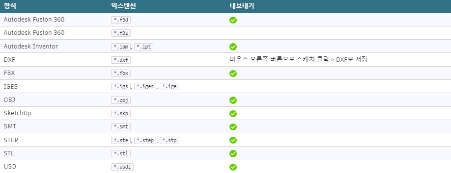
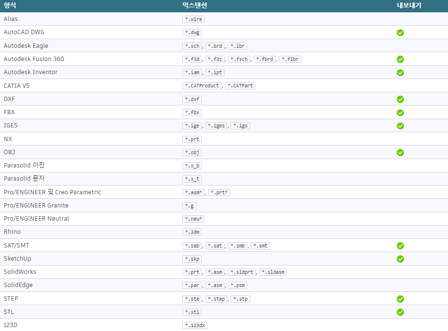

# 지원되는 파일 형식
Fusion 360에서는 다양한 상업용 및 표준 파일 형식을 지원합니다. 사용 가능한 파일 형식은 라이센스에 따라 다릅니다.

[Fusion 360 라이센스에 대해 자세히 알아보십시오.](https://www.autodesk.com/products/fusion-360/pricing)

## 표준
이러한 파일 형식은 모든 라이센스 유형에 대해 지원됩니다.

## 추가
이러한 형식은 개인용을 제외한 모든 라이센스 유형에 지원됩니다.
